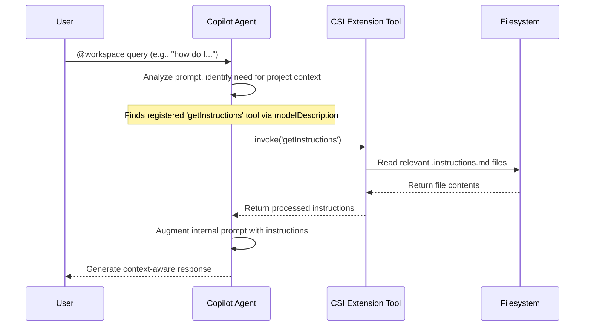

::: {composition}
id: "arch-copilot-integration"
title: "Copilot Integration Architecture"
composition-type: "system-interaction-design"
status: "stable"
version: "1.0"
brief: "Details the strategy for integrating with GitHub Copilot Agent Mode via the Language Model Tool API."
see-also: ["[[arch-main]]", "[[impl-lm-tool-class]]"]

The integration with GitHub Copilot is the central feature of this extension. It is achieved by contributing a Language Model Tool, which acts as a data provider that Copilot can choose to invoke.

## 1. Tool-Based Integration Strategy

Instead of the extension proactively pushing information to Copilot, it will register a tool that Copilot can pull from.

## 2. Tool Definition and Implementation

The tool will be defined in `package.json` (`[[impl-package-json]]`) and implemented as a TypeScript class (`[[impl-lm-tool-class]]`).

*   **`modelDescription`**: The `modelDescription` property in the tool's manifest entry is the most critical piece. It will be carefully crafted to explain to the LLM when the tool is useful (e.g., for project-specific conventions, coding standards) and what it returns (a string of instructions).
*   **`prepareInvocation`**: This method will be implemented to provide a clear, custom confirmation dialog to the user, fulfilling `[[req-security]]`.
*   **`invoke`**: This method contains the core logic to read and process the instruction files.
:::