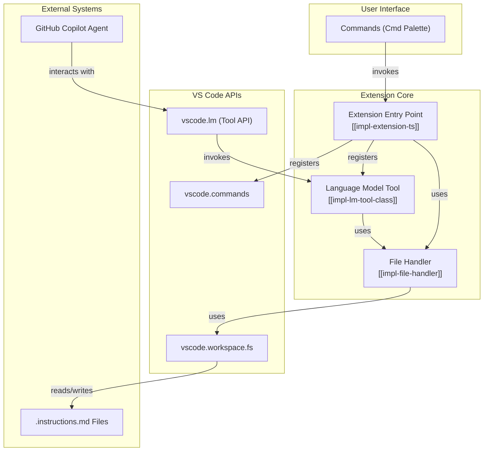

::: {composition}
id: "arch-main"
title: "Main System Architecture"
composition-type: "system-architecture-overview"
status: "stable"
version: "1.0"
brief: "Describes the overall architecture of the Copilot Self-Improvement VS Code extension."
see-also: ["[[req-core-functionality]]", "[[req-security]]"]

This architecture fulfills the project's core requirements by leveraging standard VS Code extension technologies and APIs in a modular structure. It is designed to be secure, maintainable, and tightly integrated with the VS Code environment.

## 1. Core Components

The system is composed of several key logical components that interact to provide the full functionality.

## 2. Architectural Deep Dives

- **Development Environment**: The project's development and build process is defined in `[[arch-dev-environment]]`.
- **Copilot Integration**: The specific strategy for interacting with Copilot Agent Mode is detailed in `[[arch-copilot-integration]]`.
- **Quality & Testing**: The approach to ensuring code quality and robustness is outlined in `[[arch-quality-and-testing]]`.

## 3. Language and Technology

The extension will be implemented entirely in **TypeScript**, leveraging its strong typing system to ensure code quality and maintainability. The project structure will be scaffolded using the official `yo code` generator. See `[[arch-dev-environment]]` for details.
:::